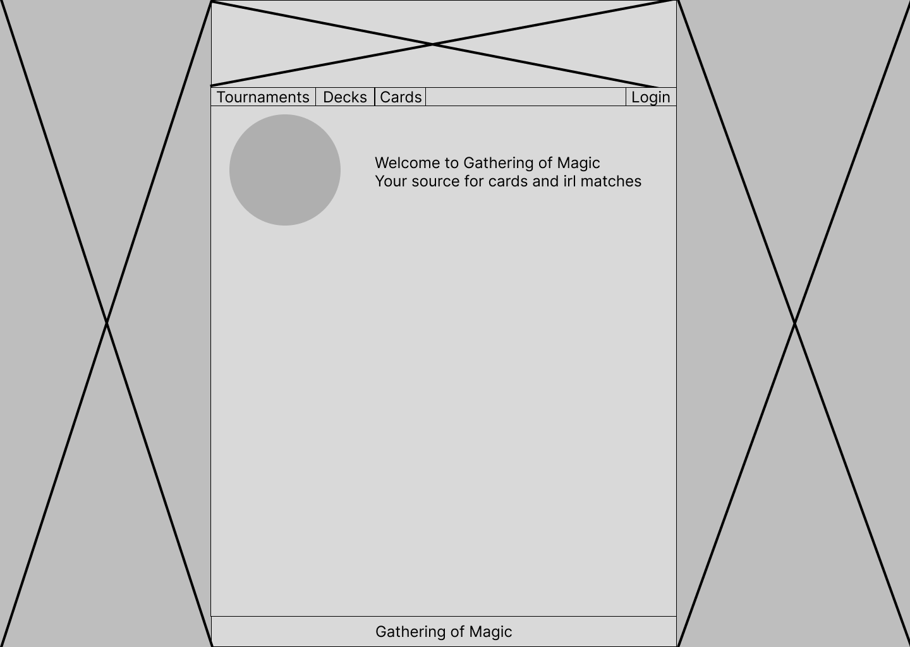
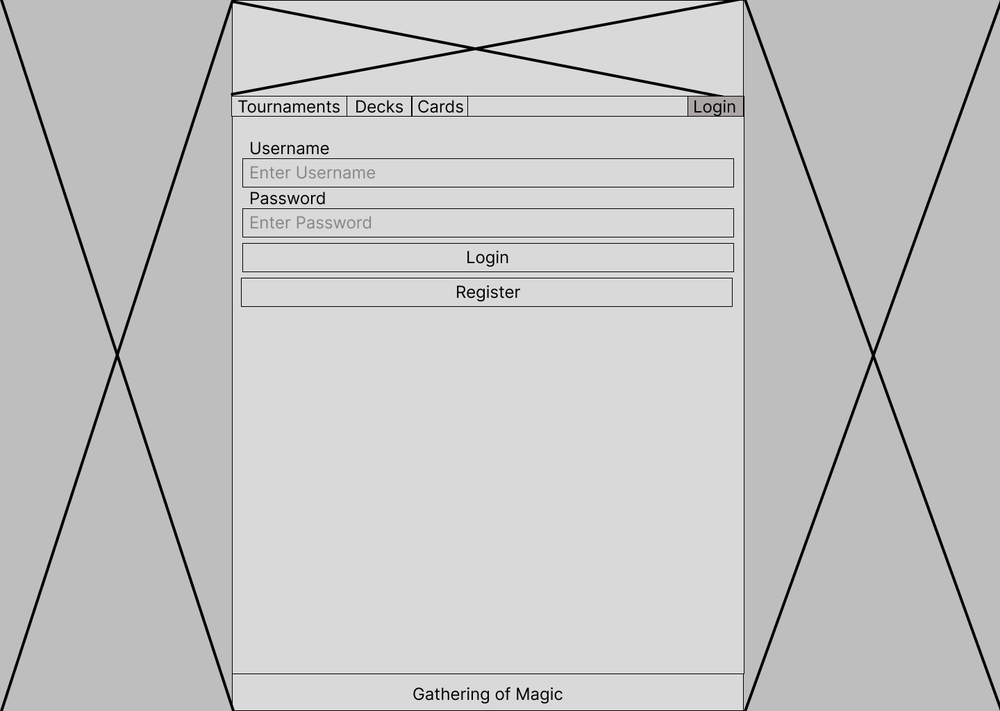
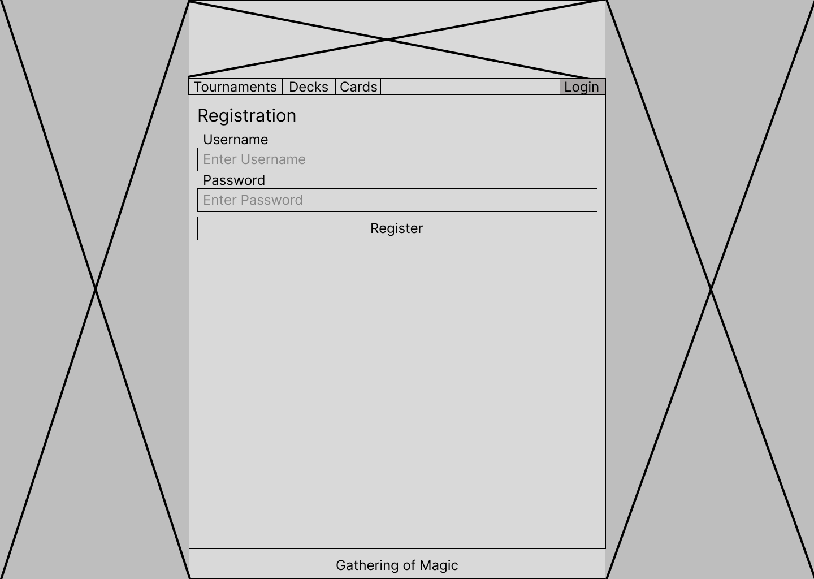

<p align="center">
    <picture>
        <source media="(prefers-color-scheme: dark)" srcset="https://raw.githubusercontent.com/T4rt4ru5/GatheringOfMagic/main/docs/KTU%20white.png">
        <source media="(prefers-color-scheme: light)" srcset="https://raw.githubusercontent.com/T4rt4ru5/GatheringOfMagic/main/docs/KTU%20black.png">
        
    </picture>
</p>

# Informatics Faculty
### T120B165 Web Application Design
### Project Gathering Of Magic
#### Purpose of the system
Project has in ming for creating system to organise "Magic The Gathering" (MTG) tournaments and easy environment
for deck building
#### Non-Formal Specification
Data is saved in database. For creation and modification of data Application Programming Interface (API) is used.
Majority of data is stored in our predefined database. However, card information is gathered from 3rd party API.
For user to access system, internet browser of choice is used.

MTG player to enter tournament must register to system. Registered user can register to tournament and create decks.
Administrator is actor who creates before mentioned tournaments, outlines duels inside tournaments and declares winners.
Player can construct decks and enter them into tournaments to duel other players. Guests can inspect entire system while
players can create/modify decks and administrator creates/modifies tournaments.
#### Functional Specification
- Guest can
  - Read card list
  - Read single cards information
  - Read deck list
  - Read singe decks information
  - Read tournaments list
  - Read single tournaments information
- Player can
  - Do everything as guest
  - Create deck
  - Modify his deck
  - Delete his deck
- Administrator can
  - Do everything as player
  - Create tournament
  - Modify tournament
  - Delete tournament
  - Create duel
  - Modify duel
  - Delete duel
## Technological specification
System consist of
- Front-End - generated raw html files within server using EJS engine
- Back-End - Node.js
- Database - MySQL
- MTG card API - https://api.magicthegathering.io

For deploying system you must use architecture provided bellow. For publishing cloud servers are used. Database can be
separate, but is recommended to store them together as APIs server for faster communication speed between database and
API. To access system you need to use interned browser and server will return raw HTML. Currently, website can be
accessed through https://gathering-of-magic-jngponmmja-uc.a.run.app/ . It is hosted on Google cloud until free trial
expires.
<p align="center">
    <picture>
        
    </picture>
</p>

# Wireframes
These are wireframes which define layout for all cases
- `Cards` 
  - `List`
      <p align="center">
          <picture>
              
          </picture>
      </p>
  - `Single`
      <p align="center">
          <picture>
              
          </picture>
      </p>
- `Deck`
  - `Create` User privileges required
    <p align="center">
    <picture>
    
    </picture>
    </p>
  - `List`
    - `Guest`
      <p align="center">
      <picture>
      
      </picture>
      </p>
    - `User` or `Admin`
      <p align="center">
      <picture>
      
      </picture>
      </p>
  - `Single`
    - `Owner`
      <p align="center">
      <picture>
      
      </picture>
      </p>
    - `Non-Owner`
      <p align="center">
      <picture>
      
      </picture>
      </p>
  - `Update` Accessible by owner of the deck.
    <p align="center">
    <picture>
    
    </picture>
    </p>
- `Duels`
  - `Create` Requires admin privileges and is accessible through `Tournament Single` 
    <p align="center">
    <picture>
    
    </picture>
    </p>
  - `Update` Requires admin privileges and is accessible through `Tournament Single`
    <p align="center">
    <picture>
    
    </picture>
    </p>
- `Home`
  - `Guest`
    <p align="center">
    <picture>
    
    </picture>
    </p>
  - `User` or `Admin`
    <p align="center">
    <picture>
    
    </picture>
    </p>
- `Session`
  - `Login`
    <p align="center">
    <picture>
    
    </picture>
    </p>
  - `Register`
    <p align="center">
    <picture>
    
    </picture>
    </p>
- `Tournament`
  - `List`
    - `Admin`
      <p align="center">
      <picture>
      
      </picture>
      </p>
    - `Non-Admin`
      <p align="center">
      <picture>
      
      </picture>
      </p>
  - `Single`
    - `Owner`
      <p align="center">
      <picture>
      
      </picture>
      </p>
    - `Non-Owner`
      <p align="center">
      <picture>
      
      </picture>
      </p>
    

# Hierarchy
- `Guest` can access only `GET` methods
- Registered `Guest` is `User` and can do as much as `Guest` and modify `Decks`
- `Admin` is `User` with higher privilege level and can do as much as `User` and organiser tournaments, create/modify duels
- This chapters format `Method` `Required Privilege`

# `/cards`
  - `GET` `Guest`
    - `200`
      - Returns card list (default `GET` params: page = 1, pageSize = 10)
    - `GET` example
      - `Request` `GET` `api/v1/cards`
      - `Response`:
      ```json
      [
        {
          "id": 1,
          "card": {
            "name": "Ancestor's Chosen",
            "manaCost": "{5}{W}{W}",
            "cmc": 7,
            "colors": [
              "W"
            ],
            "colorIdentity": [
              "W"
            ],
            "type": "Creature — Human Cleric",
            "types": [
              "Creature"
            ],
            "subtypes": [
              "Human",
              "Cleric"
            ],
            "rarity": "Uncommon",
            "set": "10E",
            "setName": "Tenth Edition",
            "text": "First strike (This creature deals combat damage before creatures without first strike.)\nWhen Ancestor's Chosen enters the battlefield, you gain 1 life for each card in your graveyard.",
            "flavor": "\"The will of all, by my hand done.\"",
            "artist": "Pete Venters",
            "number": "1★",
            "power": "4",
            "toughness": "4",
            "layout": "normal",
            "variations": [
              "5f8287b1-5bb6-5f4c-ad17-316a40d5bb0c"
            ],
            "printings": [
              "10E",
              "JUD",
              "UMA"
            ],
            "legalities": [
              {
                "format": "Commander",
                "legality": "Legal"
              },
              {
                "format": "Duel",
                "legality": "Legal"
              },
              {
                "format": "Legacy",
                "legality": "Legal"
              },
              {
                "format": "Modern",
                "legality": "Legal"
              },
              {
                "format": "Paupercommander",
                "legality": "Restricted"
              },
              {
                "format": "Penny",
                "legality": "Legal"
              },
              {
                "format": "Premodern",
                "legality": "Legal"
              },
              {
                "format": "Vintage",
                "legality": "Legal"
              }
            ],
            "id": "b7c19924-b4bf-56fc-aa73-f586e940bd42"
          }
        },
        {...}
      ]
      ```
# `/cards/id`
  - `GET` `Guest`
    - `200`
      - Returns card with specific **id**
    - `404`
      - Card with provided **id** was not found
    - `GET` example
      - `Request` `GET` `/api/v1/cards/1`
      - `Response`:
      ```json
      {
        "id": 1,
        "card": {
          "name": "Ancestor's Chosen",
          "manaCost": "{5}{W}{W}",
          "cmc": 7,
          "colors": [
            "W"
          ],
          "colorIdentity": [
            "W"
          ],
          "type": "Creature — Human Cleric",
          "types": [
            "Creature"
          ],
          "subtypes": [
            "Human",
            "Cleric"
          ],
          "rarity": "Uncommon",
          "set": "10E",
          "setName": "Tenth Edition",
          "text": "First strike (This creature deals combat damage before creatures without first strike.)\nWhen Ancestor's Chosen enters the battlefield, you gain 1 life for each card in your graveyard.",
          "flavor": "\"The will of all, by my hand done.\"",
          "artist": "Pete Venters",
          "number": "1★",
          "power": "4",
          "toughness": "4",
          "layout": "normal",
          "variations": [
            "5f8287b1-5bb6-5f4c-ad17-316a40d5bb0c"
          ],
          "printings": [
            "10E",
            "JUD",
            "UMA"
          ],
          "legalities": [
            {
              "format": "Commander",
              "legality": "Legal"
            },
            {
              "format": "Duel",
              "legality": "Legal"
            },
            {
              "format": "Legacy",
              "legality": "Legal"
            },
            {
              "format": "Modern",
              "legality": "Legal"
            },
            {
              "format": "Paupercommander",
              "legality": "Restricted"
            },
            {
              "format": "Penny",
              "legality": "Legal"
            },
            {
              "format": "Premodern",
              "legality": "Legal"
            },
            {
              "format": "Vintage",
              "legality": "Legal"
            }
          ],
          "id": "b7c19924-b4bf-56fc-aa73-f586e940bd42"
        }
      }
      ```
# `/decks`
  - `GET` `Guest`
    - `200`
      - Returns deck list (default `GET` params: page = 1, pageSize = 10)
    - `GET` example
      - `Request` `GET` `api/v1/decks`
      - `Response`:
      ```json
      [
        {
          "id": 29,
          "name": "Fiery Hail 2",
          "owner": 2,
          "ownerName": "Master",
          "cards": [
            960, 961, 962, 963, 964, 965, 966, 967, 968, 969, 970, 971, 972, 973, 974, 975, 976, 977, 978, 979, 980, 981, 982, 983, 984, 985, 986, 987, 988, 989, 990, 991, 992, 993, 994, 995, 996, 997, 998, 999, 1000, 1001, 1002, 1003, 1004, 1005, 1006, 1007, 1008, 1009, 1010, 1011, 1012, 1013, 1014, 1015, 1016, 1017, 1018, 1019, 1020, 1021, 1022, 1023, 1024, 1025, 1026, 1027, 1028, 1041, 1042, 1043, 1044, 1045, 1046, 1047, 1048, 1049, 1050, 1051, 1052, 1053, 1054, 1055, 1057, 1058, 1059, 1060, 1061, 1062, 1063, 1064, 1065, 1066, 1067, 1068, 1069, 1070, 1071, 1072, 1073, 1074, 1075, 1076, 1077, 1078, 1079
          ]
        }
      ]
      ```
  - `POST` `User`
    - `201`
      - Success. Header Location has redirection to created resource
    - `400`
      - Missing required fields from body
      - Cards do not match integer array structure
    - `403`
      - Deck must have minimum of 60 cards
      - User already has a deck with same name
      - IDs in card array has values not matching any data
    - `404`
      - Owner of deck not found
    - `POST` example
      - `Request` `POST` `api/v1/decks`:
      ```json
      {
        "name": "Storm From Within8",
        "cards": [
          960 ,961 ,962 ,963 ,964 ,965 ,966 ,967 ,968 ,969 ,970 ,971 ,972 ,973 ,974 ,975 ,976 ,977 ,978 ,979 ,980 ,981 ,982 ,983 ,984 ,985 ,986 ,987 ,988 ,989 ,990 ,991 ,992 ,993 ,994 ,995 ,996 ,997 ,998 ,999 ,1000 ,1001 ,1002 ,1003 ,1004 ,1005 ,1006 ,1007 ,1008 ,1009 ,1010 ,1011 ,1012 ,1013 ,1014 ,1015 ,1016 ,1017 ,1018 ,1019 ,1020 ,1021 ,1022 ,1023 ,1024 ,1025 ,1026 ,1027 ,1028 ,1029 ,1030 ,1031 ,1032 ,1033 ,1034 ,1035 ,1036 ,1037 ,1038 ,1039 ,1040 ,1041 ,1042 ,1043 ,1044 ,1045 ,1046 ,1047 ,1048 ,1049 ,1050 ,1051 ,1052 ,1053 ,1054 ,1055 ,1056 ,1057 ,1058 ,1059 ,1060 ,1061 ,1062 ,1063 ,1064 ,1065 ,1066 ,1067 ,1068 ,1069 ,1070 ,1071 ,1072 ,1073 ,1074 ,1075 ,1076 ,1077 ,1078 ,1079
        ]
      }
      ```
      - `Response`: Empty body, Header `Location`: `api/v1/decks/ID`
# `/decks/id`
  - `GET` `Guest`
    - `200`
      - Returns deck with specific **id**
    - `404`
      - Resource not found
    - `GET` example
      - `Request` `GET` `api/v1/decks/29`
      - `Response`:
      ```json
      {
        "id": 29,
        "name": "Fiery Hail 2",
        "owner": 2,
        "ownerName": "Master",
        "cards": [
          960, 961, 962, 963, 964, 965, 966, 967, 968, 969, 970, 971, 972, 973, 974, 975, 976, 977, 978, 979, 980, 981, 982, 983, 984, 985, 986, 987, 988, 989, 990, 991, 992, 993, 994, 995, 996, 997, 998, 999, 1000, 1001, 1002, 1003, 1004, 1005, 1006, 1007, 1008, 1009, 1010, 1011, 1012, 1013, 1014, 1015, 1016, 1017, 1018, 1019, 1020, 1021, 1022, 1023, 1024, 1025, 1026, 1027, 1028, 1041, 1042, 1043, 1044, 1045, 1046, 1047, 1048, 1049, 1050, 1051, 1052, 1053, 1054, 1055, 1057, 1058, 1059, 1060, 1061, 1062, 1063, 1064, 1065, 1066, 1067, 1068, 1069, 1070, 1071, 1072, 1073, 1074, 1075, 1076, 1077, 1078, 1079
        ]
      }
      ```
  - `PATCH` `User`
    - `204` 
      - Success. Does not have body
    - `400`
      - Cards have corrupted format
      - Card id is out of range of available cards
    - `403`
      - User already has deck named with same name
      - Deck must have minimum of 60 cards
    - `404`
      - Deck not found
      - User not found
    - `PATCH` example
      - `Request` `PATCH` `api/v1/decks/24`:
      ```json
      {
        "name": "Fiery Hail",
        "cards": [
          960 ,961 ,962 ,963 ,964 ,965 ,966 ,967 ,968 ,969 ,970 ,971 ,972 ,973 ,974 ,975 ,976 ,977 ,978 ,979 ,980 ,981 ,982 ,983 ,984 ,985 ,986 ,987 ,988 ,989 ,990 ,991 ,992 ,993 ,994 ,995 ,996 ,997 ,998 ,999 ,1000 ,1001 ,1002 ,1003 ,1004 ,1005 ,1006 ,1007 ,1008 ,1009 ,1010 ,1011 ,1012 ,1013 ,1014 ,1015 ,1016 ,1017 ,1018 ,1019 ,1020 ,1021 ,1022 ,1023 ,1024 ,1025 ,1026 ,1027 ,1028 ,1029 ,1030 ,1031 ,1032 ,1033 ,1034 ,1035 ,1036 ,1037 ,1038 ,1039 ,1040 ,1041 ,1042 ,1043 ,1044 ,1045 ,1046 ,1047 ,1048 ,1049 ,1050 ,1051 ,1052 ,1053 ,1054 ,1055 ,1056 ,1057 ,1058 ,1059 ,1060 ,1061 ,1062 ,1063 ,1064 ,1065 ,1066 ,1067 ,1068 ,1069 ,1070 ,1071 ,1072 ,1073 ,1074 ,1075 ,1076 ,1077 ,1078 ,1079
        ]
      }
      ```
      - `Response`: Empty body
  - `DELETE` `User`
    - `204`
        - Success. Does not have body
    - `403`
      - Deck already used in tournament CAN NOT be deleted
    - `Delete` example
      - `Request` `DELETE` `api/v1/decks/29`
      - `Response`: Empty body

# `/duels`
- `GET` `Guest`
    - `200`
        - Returns duel list (default `GET` params: page = 1, pageSize = 10)'
    - `GET` example
      - `Request` `GET` `api/v1/duels`
      - `Response`:
      ```json
      [
        {
          "id": 18,
          "tournament": 1,
          "decks": [
            29, 33
          ],
          "winner": 33
        },
        {...}
      ]
      ```
- `POST` `Admin`
    - `201`
        - Success. Header Location has redirection to created resource
    - `400`
        - Missing required fields from body
        - Decks do not match integer array structure
    - `403`
        - Duel do not consist of exact number of 2 decks
        - Decks provided are same (can not play against itself)
        - Winner deck is not deck from dueling deck list
        - Provided decks have same owner, implying player is fighting against himself
    - `404`
        - Tournament not found
        - Winner deck not found
        - Provided decks are not found in database
    - `POST` example
      - `Request` `POST` `api/v1/duels`:
      ```json
      {
        "tournament": 2,
        "winner": 34,
        "decks": [37, 34]
      }
      ```
      - `Response`: Empty body
# `/duels/id`
- `GET` `Guest`
    - `200`
      - Returns duel with specific **id**
    - `404`
      - Resource not found
    - `GET` example
      - `Request` `GET` `api/v1/duels/19`
      - `Response`:
      ```json
      {
        "id": 19,
        "tournament": 2,
        "decks": [
          31, 32
        ],
        "winner": 31
      }
      ```
- `PATCH` `Admin`
    - `204`
      - Success. Does not have body
    - `400`
      - Decks do not match integer array structure
    - `403`
      - Duel do not consist of exact number of 2 decks
      - Decks provided are same (can not play against itself)
      - Winner deck is not deck from dueling deck list
      - Provided decks have same owner, implying player is fighting against himself
    - `404`
      - Duel not found
      - Tournament not found
      - Winner deck not found
      - Provided decks are not found in database
    - `PATCH` example
      - `Request` `PATCH` `api/v1/duels/28`:
      ```json
      {
         "tournament": 2,
         "winner": 2,
          "decks": [2, 5]
      }
      ```
      - `Response`: Empty body
- `DELETE` `Admin`
    - `204`
        - Success. Does not have body
    - `DELETE` example
      - `Request` `DELETE` `api/v1/duels/28`
      - `Response`: Empty body
# `/tournaments`
- `GET` `Guest`
    - `200`
        - Returns tournament list (default `GET` params: page = 1, pageSize = 10)
    - `GET` example
      - `Request` `GET` `api/v1/tournaments`
      - `Response`:
      ```json
      [
        {
          "id": 1,
          "username": "GameMaster",
          "location": "KTU Kompileriai",
          "duels": [
            18, 31, 32, 34, 35
          ]
        },
        {
          "id": 2,
          "username": "GameMaster",
          "location": "Akropolio Baitukas",
          "duels": [
            19, 26, 29 
          ]
        }
      ]
      ```
- `POST` `Admin`
    - `201`
        - Success. Header Location has redirection to created resource
    - `400`
        - Missing required fields from body
    - `404`
        - Organiser not found
    - `POST` example
      - `Request` `POST` `api/v1/tournaments`:
      ```json
      {
        "location": "Antano Antanausko Gaming Lobby"
      }
      ```
      - `Response`: Empty body, Header `Location`: `api/v1/tournament/ID`
# `/tournaments/id`
- `GET` `Guest`
    - `200`
        - Returns duel with specific **id**
    - `404`
        - Resource not found
    - `GET` example
      - `Request` `GET` `api/v1/tournaments/1`
      - `Response`:
      ```json
      {
        "id": 1,
        "username": "GameMaster",
        "location": "KTU Kompileriai",
        "duels": [
          18, 31, 32, 34, 35
        ]
      }
      ```
- `PATCH` `Admin`
    - `204`
      - Success. Does not have body
    - `404`
      - Tournament not found
      - Organiser not found
    - `PATCH` example
      - `Request` `PATCH` `api/v1/tournaments/1`
      - `Response`:
      ```json
      {
        "location": "Antano Antanausko Gaming Lobby"
      }
      ```
- `DELETE` `Admin`
    - `204`
      - Success. Does not have body
    - `403`
      - Tournament with duels assigned to it CAN NOT be deleted
    - `DELETE` example
      - `Request` `DELETE` `api/v1/tournaments/1`
      - `Response`: Empty body
# Conclusions
Creating API is great if task is direct at solving problem. For big systems it is necessary to use API as work will get
out of hand without structure. In general creating API isn't exactly to hard, however, developing on cloud is something
else. Cloud service providers like money. Therefore, if you are new on cloud development and don't have free trial you
will lose money fast. Therefore, good practise is to learn container paradigm (example Docker) as most of the cloud 
providers use mainly containers. Knowing them beforehand will minimize cost of developmental start-up.